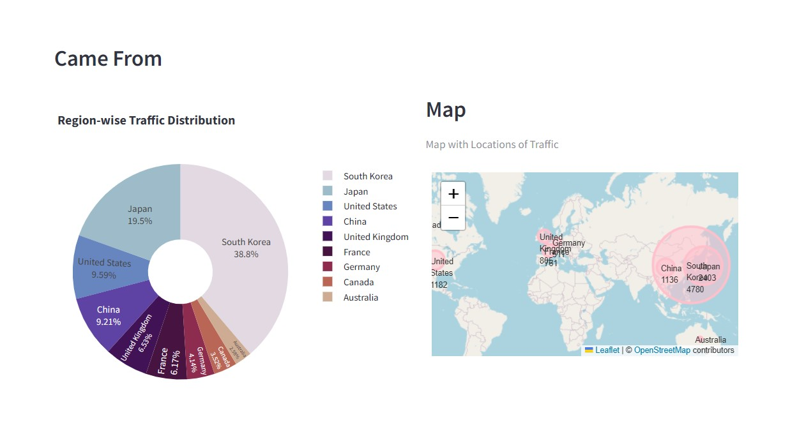

# E-commerce User Behavior Dashboard
 

# Data Description

## Data Source
This dataset is from the [Online Shoppers Purchasing Intention Dataset](https://archive.ics.uci.edu/dataset/468/online+shoppers+purchasing+intention+dataset) provided by the University of California, Irvine (UCI) Machine Learning Repository.

## Data Description
This dataset records the behavior of visitors to an online shopping website. Each column in the dataset is described as follows:

- **Administrative**: Represents the number of visits to administrative pages on the website. These pages typically include account settings, dashboard, or other backend functionalities.
- **Administrative Duration**: Indicates the total time spent by visitors on administrative pages during their sessions on the website.
- **Informational**: Denotes the number of visits to informational pages, which usually contain non-commercial content such as FAQs, company information, or educational material.
- **Informational Duration**: Reflects the total time visitors spent on informational pages while browsing the website.
- **Product Related**: Represents the number of visits to pages related to products available for sale on the website, including product listings, descriptions, or reviews.
- **Product Related Duration**: Indicates the total time spent by visitors on pages related to products during their sessions.
- **Bounce Rate**: Refers to the probability of visitors leaving the website from a specific page without interacting further. A high bounce rate may indicate a lack of relevance or poor user experience.
- **Exit Rate**: Represents the percentage of visitors who exit the website from a particular page, considering it as the last page of their session. It helps identify pages with high abandonment rates.
- **Page Value**: Represents the average value of a page visited by a user before completing a transaction. It helps measure the effectiveness of individual pages in driving conversions.
- **Special Day**: Indicates the proximity of the visit date to specific occasions or holidays. It considers the timing between the order date and delivery date, assigning nonzero values during relevant periods.
- **Operating Systems**: Records the operating system used by visitors while accessing the website, such as Windows, macOS, Linux, Android, or iOS.
- **Browser**: Captures the web browser employed by visitors for browsing the website, including popular options like Chrome, Firefox, Safari, Internet Explorer, Edge, and others.
- **Region**: Specifies the geographical region of the visitor, providing insights into the demographic distribution of website traffic.
- **Traffic Type**: Represents the category or source of traffic directing visitors to the website, such as organic search, direct traffic, referral traffic, social media traffic, etc.
- **Visitor Type**: Indicates whether the visitor is a returning or new visitor to the website, helping differentiate between loyal customers and potential prospects.
- **Weekend**: A Boolean variable indicating whether the visit date falls on a weekend (Saturday or Sunday).
- **Month**: Records the month in which the visit occurred, providing temporal insights into website traffic patterns and seasonality.
   
(This description has been modified by the developer for integration into the dashboard.)

This dataset can be used to understand the behavior of visitors to an online shopping website and analyze purchasing intentions.

# Analysis Dashboard Overview

The analysis dashboard can be divided into three main sections, each providing insights into different aspects of user behavior:

## Traffic Analysis
This section provides insights into the traffic directed to the website. Key features include:
- **Traffic Type**: Line chart showing the trend of different types of traffic, helping to understand the sources of traffic to the website.
- **Region Distribution**: Pie chart visualizing the distribution of visitors by region, indicating which regions show the most interest in the website.
- **Traffic Map**: Map visualization displaying the geographic distribution of visitors, highlighting areas with the highest traffic influx.

## User Engagement Analysis
This section analyzes user engagement and interaction. Key features include:
- **Session Analysis**: Displaying the number of visits and average session duration on administrative, informational, and product-related pages.
- **Visitor Type Analysis**: Stack bar chart visualizing the ratio of new visitors to returning visitors, highlighting differences in visitor types.

## System Analysis
This section provides insights into the operating systems and browsers used by visitors. Key features include:
- **Operating Systems Distribution**: Pie chart showing the distribution of operating systems used by visitors, identifying the most common operating systems.
- **Browser Distribution**: Pie chart showing the distribution of browsers used by visitors, identifying the most common browsers.

This project aims to offer a comprehensive analysis of website traffic, user engagement, and system usage through an intuitive dashboard interface. By providing detailed insights into these key metrics, the goal is to empower website operators to gain a deeper understanding of user behavior and optimize website performance effectively.